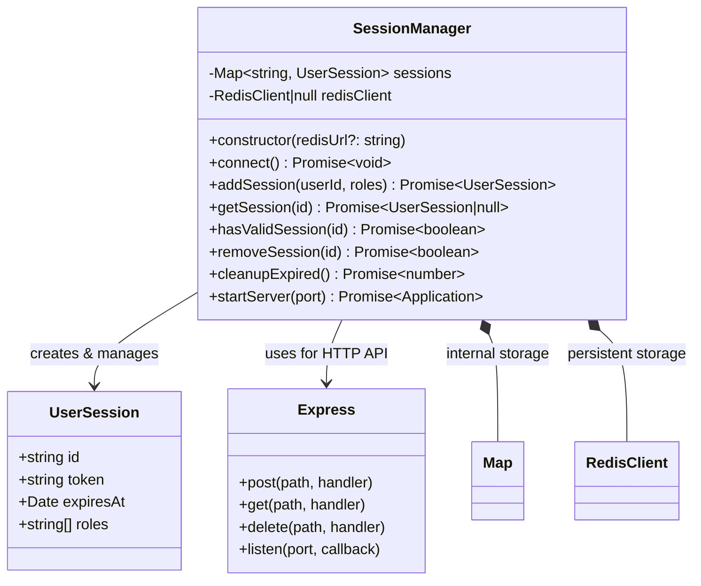

# Development Guide - SessionManager

## Class Diagram



## Architektur

### Komponenten

1. **SessionManager** (Kernklasse)
   - Verwaltet Sessions in einer internen `Map<string, UserSession>`
   - Synchronisiert mit Redis für Persistenz
   - Bietet HTTP-Server mit REST-API

2. **UserSession** (Datentyp)
   - Immutable nach Erstellung
   - TTL von 1 Stunde standardmässig

3. **Redis** (Persistenzschicht)
   - Key-Format: `session:{id}`
   - JSON-serialisierte UserSession-Objekte

### Datenfluss

```
Client --> HTTP Request --> Express Router --> SessionManager Method --> Redis/Map
Client <-- HTTP Response <-- Express Router <-- SessionManager Result <-- Redis/Map
```

### Session Lifecycle

```
[Create] --> addSession() --> Map.set() --> Redis.set()
    |
    v
[Active] --> getSession() --> Map.get() --> TTL check
    |                    |
    |                    +--> expired? --> removeSession()
    |                    |
    +--------------------+ not expired --> return session
    |
    v
[Cleanup] --> cleanupExpired() --> iterate Map --> remove expired --> Redis.del()
```

## Entwicklungsumgebung aufsetzen

### Abhängigkeiten installieren

```bash
npm install
```

### Code kompilieren

```bash
npm run build
```

Erzeugt `dist/bundle.js` mit esbuild.

### Tests ausführen

```bash
# Unit Tests
npm test

# E2E Tests (benötigt Docker)
npm run e2e
```

## Docker Deployment

### Manuelles Deployment

```bash
# Start
EXAMPLE_SESSIONMANAGER_PORT=3000 bash deploy.sh start

# Stop
bash deploy.sh stop
```

### Docker Compose

```yaml
# deploy/docker-compose.yaml
services:
  redis:
    image: redis:7-alpine
  session-manager:
    build:
      context: .
      dockerfile: deploy/Dockerfile
    ports:
      - "${EXAMPLE_SESSIONMANAGER_PORT:-3000}:3000"
    depends_on:
      - redis
```

## Testing

### Unit Tests (`tests/sessionManager.test.ts`)

Testen die SessionManager-Klasse direkt ohne HTTP-Server oder Redis.

```typescript
const manager = new SessionManager(); // Ohne Redis
const session = await manager.addSession('user1', ['admin']);
```

### E2E Tests (`tests/sessionManager.e2e.test.ts`)

Testen die vollständige Anwendung gegen einen laufenden Docker Container.

```typescript
// Findet zufälligen Port, startet Container, testet API
const { status, data } = await apiRequest('/sessions', {
    method: 'POST',
    body: { userId: 'test', roles: ['admin'] },
});
```

## OpenAPI Spezifikation

Die vollständige API-Spezifikation findet sich in `openapi.yaml`.

```bash
# Mit Swagger UI öffnen
npx swagger-cli bundle openapi.yaml --outfile swagger.json
```