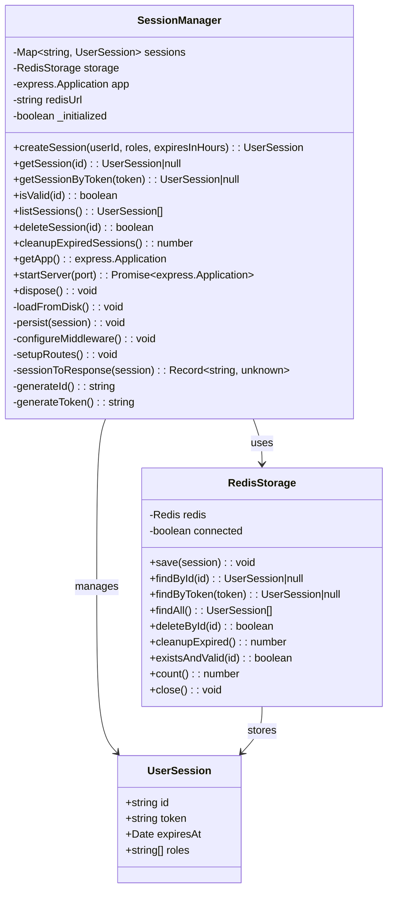
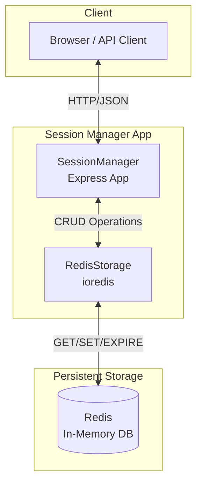

# Development Guide

## Architecture

### Class Diagram



### Component Diagram



## Storage-Entscheidung: Redis

### Warum Redis gewählt wurde

Für Example20-1 wurde **Redis** als Persistenzschicht gewählt, da es für Session-Management ideal ist:

1. **Native TTL-Unterstützung** – Sessions laufen automatisch ab, keine manuelle Cleanup nötig
2. **In-Memory Performance** – Extrem schnelle Lese-/Schreibzugriffe
3. **Etablierte Lösung** – Redis wird bereits in Example19 erfolgreich eingesetzt
4. **Skalierbar** – Cluster-Modus und Replication für Production-Systeme
5. **Indizierung** – Einfache Token-basierte Lookups über Hash-Keys

### Architektur

- **SessionManager**: In-Memory Map für schnelle Zugriffe + Express HTTP API
- **RedisStorage**: Abstraktionsschicht für Redis-Operationen
- **Redis**: Persistente Speicherung mit automatischer Expiration

### Redis Key-Design

```
session:{id} -> JSON-serialized UserSession
token:{token} -> session:id (Index für schnelle Lookups)
```

Beispiel:
```
session:abc123 -> {"id":"abc123","token":"xyz...","expiresAt":"2024-...","roles":["admin"]}
token:xyz... -> abc123
```

## Development Setup

### Prerequisites

- Node.js 20+
- npm
- Docker & Docker Compose (for E2E tests)

### Install Dependencies

```bash
npm install
```

### Build

```bash
npm run build
```

### Run Tests

```bash
# All tests
npm test

# Only unit tests
npm test -- --testPathIgnorePatterns=e2e

# Only E2E tests
npm test -- --testPathPattern=e2e
```

### Run E2E Tests with Docker

```bash
# Full E2E flow (build, deploy, test, teardown)
npm run e2e

# Manual E2E setup
npm run e2e-setup

# Manual E2E teardown
npm run e2e-teardown
```

## Testing

### Unit Tests

Located in `tests/sessionManager.test.ts`. Tests the core logic of `SessionManager` and `RedisStorage` classes in isolation. Requires a running Redis instance on `localhost:6380`.

### E2E Tests

Located in `tests/sessionManager.e2e.test.ts`. Tests the HTTP API endpoints against a running Docker container (including Redis).

## Building & Deployment

### Build Process

1. `esbuild` bundles `src/sessionManager.ts` into `dist/bundle.js`
2. The bundle includes all dependencies (Express, ioredis)
3. Docker image is built from the bundle

### Docker Deployment

The `deploy.sh` script handles:
1. Installing dependencies
2. Building with esbuild
3. Building and running the Docker container

### Docker Compose

The `deploy/docker-compose.yaml` defines:
- `session-manager` service (Node.js 20 Alpine)
- `redis` service (Redis 7 Alpine with AOF persistence)
- Healthchecks for both services
- Volume mounting for Redis data persistence

## Adding New Features

1. Add new methods to `SessionManager` class
2. Add corresponding API routes in `setupRoutes()`
3. Update OpenAPI spec in `openapi.json`
4. Add unit tests in `sessionManager.test.ts`
5. Add E2E tests in `sessionManager.e2e.test.ts`
6. Update documentation
