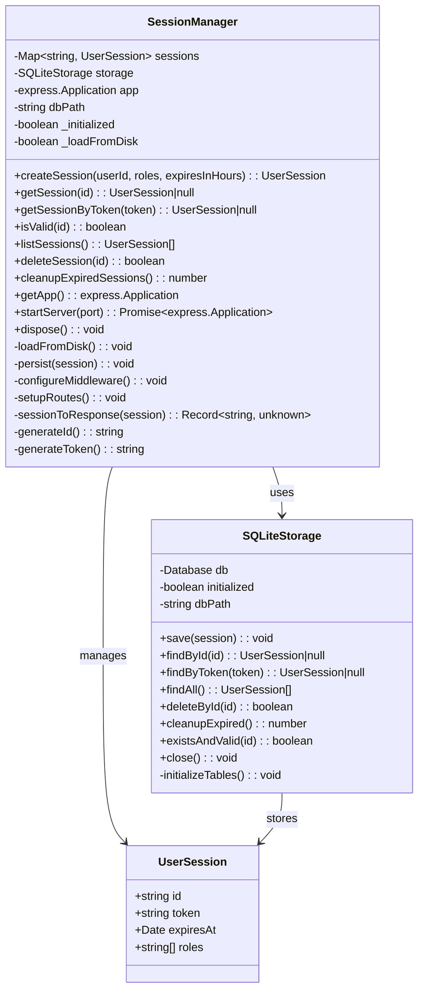
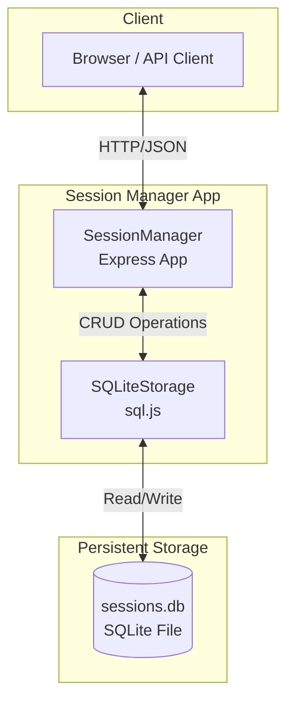

# Development Guide

## Architecture

### Class Diagram



### Component Diagram



## Development Setup

### Prerequisites

- Node.js 20+
- npm
- Docker & Docker Compose (for E2E tests)

### Install Dependencies

```bash
npm install
```

### Build

```bash
npm run build
```

### Run Tests

```bash
# All tests
npm test

# Only unit tests
npm test -- --testPathIgnorePatterns=e2e

# Only E2E tests
npm test -- --testPathPattern=e2e
```

### Run E2E Tests with Docker

```bash
# Full E2E flow (build, deploy, test, teardown)
npm run e2e

# Manual E2E setup
npm run e2e-setup

# Manual E2E teardown
npm run e2e-teardown
```

## Testing

### Unit Tests

Located in `tests/sessionManager.test.ts`. Tests the core logic of `SessionManager` and `SQLiteStorage` classes in isolation.

### E2E Tests

Located in `tests/sessionManager.e2e.test.ts`. Tests the HTTP API endpoints against a running Docker container.

## Building & Deployment

### Build Process

1. `esbuild` bundles `src/sessionManager.ts` into `dist/bundle.js`
2. The bundle includes all dependencies (Express, better-sqlite3)
3. Docker image is built from the bundle

### Docker Deployment

The `deploy.sh` script handles:
1. Installing dependencies
2. Building with esbuild
3. Creating Dockerfile on-the-fly
4. Building and running the Docker container

### Docker Compose

The `deploy/docker-compose.yaml` defines:
- `session-manager` service (Node.js 20 Alpine)
- Volume mounting for persistent data

## Storage-Entscheidung: SQLite vs. Redis

### Warum SQLite gewählt wurde

Für dieses Projekt wurde **SQLite** (via sql.js) als Persistenzschicht gewählt, obwohl Redis in Example19 erfolgreich eingesetzt wurde. Die Gründe:

1. **Keine externe Abhängigkeit** – SQLite ist embedded, kein separater Datenbank-Server nötig
2. **Single-File-Persistenz** – Die gesamte Datenbank ist eine einzige Datei (`sessions.db`), einfach zu sichern und zu transportieren
3. **Zero-Config** – Keine Netzwerkports, keine Authentifizierung, keine Konfiguration
4. **Docker-einfach** – Ein Volume-Mount für die DB-Datei reicht, kein eigenes Datenbank-Container-Setup
5. **Ausreichend für Session-Management** – Sessions sind typischerweise kleine Datenstrukturen mit niedriger Schreiblast

### Warum nicht Redis?

Redis wäre für Session-Management **technisch besser geeignet**, da es:

- **Native TTL-Unterstützung** hat (Sessions laufen automatisch ab)
- **Schneller ist** (In-Memory vs. File-basiert)
- **Besser skaliert** (Cluster-Modus, Replication)
- **In Example19 bewährt** wurde

**Hauptgrund gegen Redis in diesem Projekt:**
- Redis erfordert einen **zusätzlichen Docker-Container** und Netzwerk-Konfiguration
- Erhöht die Komplexität des Deployments (Healthchecks, Volume-Management, Authentifizierung)
- Für ein **Demo/Prototyping** ist der Overhead unverhältnismäßig

### Vergleich: SQLite vs. Redis für Sessions

| Kriterium | SQLite (gewählt) | Redis (Alternative) |
|-----------|------------------|---------------------|
| **Setup-Komplexität** | Niedrig (embedded) | Mittel (Container nötig) |
| **Performance** | Gut (für Demo) | Sehr gut (In-Memory) |
| **TTL-Unterstützung** | Manuell (cleanup) | Native (`EXPIRE`) |
| **Persistenz** | File-basiert | RDB/AOF |
| **Skalierbarkeit** | Limitiert (Single-File) | Hoch (Cluster) |
| **Docker-Abhängigkeiten** | Keine | +1 Container |
| **Eignung für Demo** | ✅ Ideal | ⚠️ Overkill |
| **Eignung für Production** | ⚠️ Limitiert | ✅ Empfohlen |

### Empfehlung für Production

Für ein **Production-System** wird **Redis** empfohlen:

```yaml
# deploy/docker-compose.production.yaml
services:
  session-manager:
    image: node:20-alpine
    ports:
      - "${SESSION_MANAGER_PORT:-3000}:3000"
    depends_on:
      redis:
        condition: service_healthy
    environment:
      - REDIS_URL=redis://redis:6379/0

  redis:
    image: redis:7-alpine
    ports:
      - "6379:6379"
    volumes:
      - redis-data:/data
    healthcheck:
      test: ["CMD", "redis-cli", "ping"]
      interval: 5s
      retries: 5
    command: redis-server --appendonly yes

volumes:
  redis-data:
```

Die Session-Storage würde dann wie folgt implementiert werden:

```typescript
import Redis from 'ioredis';

class RedisStorage {
  private redis: Redis;

  constructor(url: string = 'redis://localhost:6379/0') {
    this.redis = new Redis(url);
  }

  async save(session: UserSession): Promise<void> {
    const ttl = Math.max(1, Math.floor((session.expiresAt.getTime() - Date.now()) / 1000));
    await this.redis.setex(
      `session:${session.id}`,
      ttl,
      JSON.stringify(session)
    );
    // Index by token für schnelle Lookups
    await this.redis.setex(
      `token:${session.token}`,
      ttl,
      session.id
    );
  }

  async findById(id: string): Promise<UserSession | null> {
    const data = await this.redis.get(`session:${id}`);
    return data ? JSON.parse(data) : null;
  }

  async findByToken(token: string): Promise<UserSession | null> {
    const sessionId = await this.redis.get(`token:${token}`);
    return sessionId ? this.findById(sessionId) : null;
  }

  async deleteById(id: string): Promise<boolean> {
    const exists = await this.redis.exists(`session:${id}`);
    if (exists) {
      const session = await this.findById(id);
      if (session) {
        await this.redis.del(`token:${session.token}`);
      }
      await this.redis.del(`session:${id}`);
    }
    return exists > 0;
  }

  async cleanupExpired(): Promise<number> {
    // Redis expired Sessions automatisch – keine manuelle Cleanup nötig
    return 0;
  }

  async close(): Promise<void> {
    await this.redis.quit();
  }
}
```

### Fazit

| Use-Case | Empfohlene Storage |
|----------|-------------------|
| Demo / Prototyping / Learning | **SQLite** (wie hier) |
| Production / Hohe Last | **Redis** |
| Enterprise / Horizontal Scale | **Redis Cluster** oder **PostgreSQL** |
ENDOFFILE

1. Add new methods to `SessionManager` class
2. Add corresponding API routes in `setupRoutes()`
3. Update OpenAPI spec in `openapi.json`
4. Add unit tests in `sessionManager.test.ts`
5. Add E2E tests in `sessionManager.e2e.test.ts`
6. Update documentation
